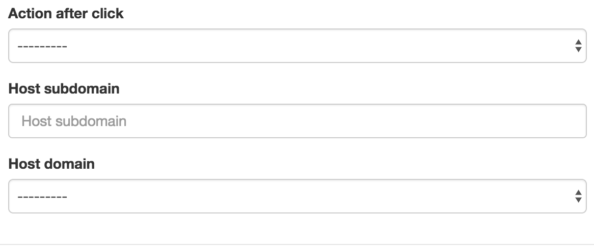
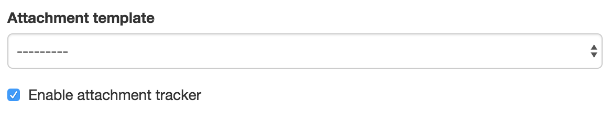
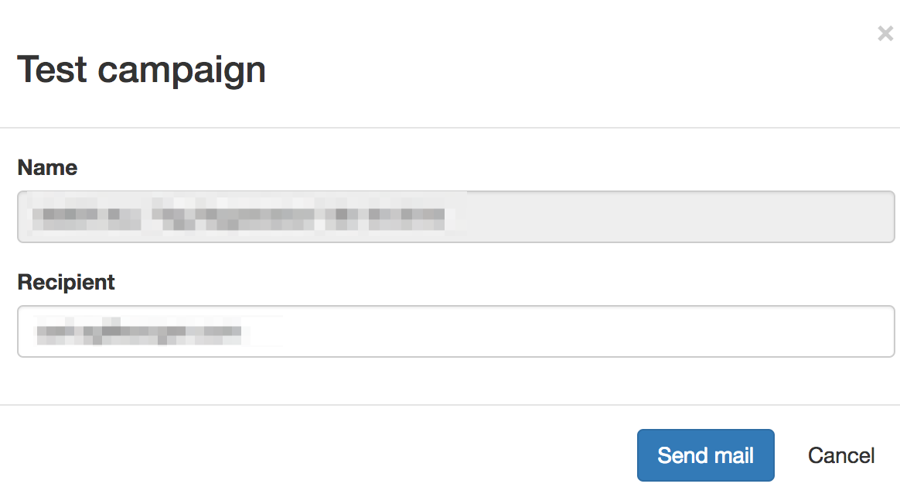
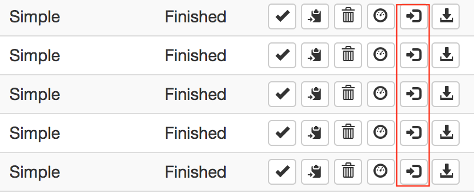

# Campaigns

A campaign is the organization of what you will send, to whom and when.

You can create three kind of campaign which will be discussed below. But
here are the mandatory fields used in both campaign types:

- **Name**: name of the campaign, it's up to you, but you can't have
  two campaigns with the same name
- **Targets**: chose one or more targets list to launch awareness on
- **Start date**: the exact date (year, month, day, hour and minute)
  the campaign will be automatically started.
- **End date**: the exact date when the campaign will be stopped (no
  more click will be taken in account after this date and the results
  will be downloadable).
- **On behalf of**: the left part of the mail address (without domain)
  that will send the mails, example: firstname.lastname
- **From domain**: the domain used to send the mail (selected from a
  drop-down list)
- **Display name**: the full name that will be displayed next to the
  mail address, ex: Display Name <<not.displayname@domain.com>>
- **Mail template**: the mail that will be sent to the targets (the
  drop-down list is filtered according to the template type)
- **Enable mail tracker**: this checkbox allows you to add a blank
  image or not to track the mail opening

## Simple campaign

A "simple campaign" allow you to send mails with links and to execute an
action when the targets click on them. The dedicated fields for this
kind of campaign are the followings:

- **Action after click**: define what will be displayed to the user
  after clicking on the link. It can be a redirection or an awareness
  webpage.
- **Host domain**: defines the domain that will host the redirection
  or the awareness webpage. The link in the mail will be updated
  automatically.

## Campaign with attachment

With this kind of campaign you can define the mail template you will use
and the attachment to add into it.

You can choose the dedicated template using the "Attachment template"
field, and you can add or not a tracker in it to detect the openings.

## Fake form campaign

The fake forms campaigns works like the simples campaigns except that
you can display a previously built fake form.

You can also define an action if the target submits the form. This can
be a redirection or an awareness web page.

The fake form, and the action after submit will be hosted using the
domain defined in the "Host domain" field

## Fake ransom campaign

## Test feature

Once your campaign is created, it can be tested using the test
functionality.

By clicking on the following button, a popup will be displayed to
specify a mail address to receive the mail.

This will allow you to test the whole campaign without polluting the
statistics before the beginning.

## Dashboard

Once your campaign is started, you can display a dashboard to get
campaign progress:

By clicking on the following button, a popup will be display
useful information about your campaign:

## IDs submission

This functionality allows you to submit ID from targets who signaled the
mail to security teams.

Ids can be found:

- In the links generated in the received mail
- In the mail headers
- In the trackers urls

You can paste full links, ids will be extracted automatically.

## Downloading results

Anonymous results can be downloaded using the dedicated button. A XLSX
file will be dropped automatically (can take some time for a big
campaign).

In the results the mail address is deleted and replaced by the targets
IDs.

This behavior has been asked by French trade unions, to prevent
identifying people.

But you can bypass this by adding a tag with the mail or name. We do not
recommend this as we're not here to reprimand users!
