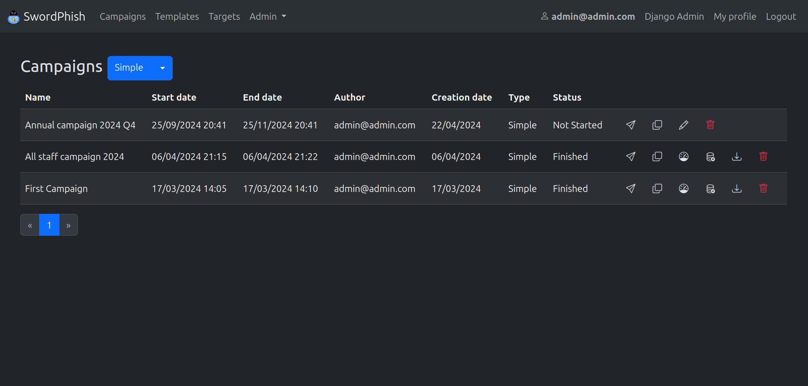

# SwordPhish

<b>S</b>wordphish is a platform allowing to create and manage fake phishing
campaigns.

The goal of Swordphish is to raise awareness of your users regarding
phishing easily and in a secure way.

We believe that it's totally utopian to reach the goal of zero click on
a phishing campaign.
However, we believe we can reduce the number of victims
and overall increase the number of reporting to security teams by
training people using this kind of tool.

Identifying security contacts may be hard in a big structure like ours,
that's why we developed Swordphish and a mail client button helping
our users to report suspicious mail to security teams just by clicking
on a button. No more intranet hunting looking for that security contact,
just click, and it's done!

This choice seriously improved the visibility of what our users are
receiving, and we decided to offer it to the community!

Swordphish can be used to train people identifying suspicious mails, and
it can help checking that people correctly report the mails to security
teams.

