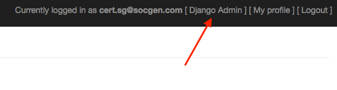
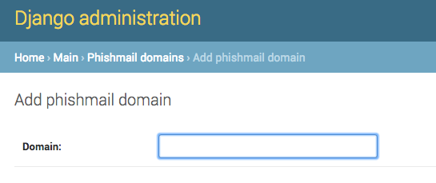

.. _installation:

Installation
============
Requirements
------------
Swordphish requires a few important things before starting installation process:

* **A server**: we recommend to adjust the choice of the server depending on the campaign sizes you want to do (100k targets is a BIG campaign)
* **At least two domains names**: one to join Swordphish web page and at least one phishing domain (to send mails and host phishing pages)
* **A mail server**: we won't cover the mail server installation here, but keep in mind that a well configured mail server can accelerate drastically phishing mails diffusion

The domain name used to join Swordphish interface must have at least a A entry in the DNS zone pointing to the servers's IP.

The domain(s) used to send mail and host phishing pages must have at least two entry in the DNS Zone. An A entry pointing to the server and a subdomain wildcard entry pointing to the same server IP (it allows to use subdomains in phishing pages).

The following installation process has been tested on Ubuntu Server (16.04) but you can use any Linux (or Unix ?) distro you like, but we won't provide any support for that.

Installing Dependencies
-----------------------

Required packages::

  #>apt-get install build-essential libpq-dev nginx git supervisor redis-server
  #>apt-get install python3-dev python3-pip postgresql postgresql-contrib
  #>apt-get install virtualenv virtualenvwrapper

Create a dedicated user for security purpose::

  #>adduser swordphish --disabled-password

Add the following line in the user's ~/.profile to enable virtualenvwrapper::

  export WORKON_HOME=~/.virtualenvs
  mkdir -p $WORKON_HOME
  source `which virtualenvwrapper.sh`

Switch to newly created user and git-clone Swordphish repository::

  #>su - swordphish
  $swordphish>git clone https://github.com/certsocietegenerale/swordphish-awareness.git swordphish

Ensure that virtualenvwrapper has been loaded in user's environment and create the virtualenv::

  $swordphish>source ~/.profile
  $swordphish>mkvirtualenv -p python3 -a /home/swordphish/swordphish/ swordphish

You can chose not to create the virtualenv but **we highly recommend it** to prevent any side effect with another app installed on the same server for example.

Install all the python dependencies::

  (swordphish)$swordphish>pip install -r requirements.txt

Configuring and Creating database
---------------------------------

Switch to postgresql user::

  #>su - postgres
  $postgres>createuser -P swordphish
  $postgres>createdb --owner swordphish swordphish

Don't forget the password you'll need it later !

Depending on the size of the campaigns you want to do, consider tuning Postgresql performance depending of the machine you run swordphish on.

Here is a list of parameter you should consider adapt:

* **shared_buffers**: memory used to cache data, consider setting this to 1/4 of the total RAM
* **work_mem**: 50MB is a nice value if you have more than 16go of RAM
* **maintenance_work_mem**: the maximum memory postgres can use for maintenance (index creation etc)
* **wal_buffers**: 1/32 of the size of shared_buffers, with an upper limit of 16MB
* **effective_cache_size**: 1/2 of total memory would be a normal conservative setting

Swordphish Configuration
------------------------

Now let's adapt Swordphish to your environment. Go to the path where you've installed the code and copy the settings.py file to a new one::

  $swordphish>cd /home/swordphish/swordphish/
  $swordphish>cp Swordphish/settings.py Swordphish/settings_prod.py

Then generate a new secret-key::

  $swordphish>workon swordphish
  (swordphish)$swordphish>./manage.py generate_secret_key

Then open the newly created settings_prod.py with your favorite editor. Here is the value you must change:

* **ADMINS**: fill the array with the different admins' mails (they'll received stacktraces and potential errors)
* **DEBUG**: set this to False once you have tested everything
* **DATABASES**: set the credentials of the postgres account you created before
* **SWORPDHISH_URL**: set this to the URL you'll use to reach Swordphish interface
* **USER_ACCOUNT_CREATION_MAIL_SENDER**: the mail address which will be used to send swordphish accounts creation mails
* **USER_ACCOUNT_CREATION_MAIL_CONTACT**: the mail address used as reply to in the swordphish accounts creation mails
* **SERVER_EMAIL**: mail address which will be used to send diffrent mails like stacktraces
* **EMAIL_HOST**: mail server address
* **EMAIL_PORT**: mail server port
* **EMAIL_HOST_USER**: optional
* **EMAIL_HOST_PASSWORD**: optional
* **HOSTING_DOMAIN**: the domain which will be used to reach sworsphish interface (used to prevent targets from reaching the interface using phishing domains)

Let's start using this freshly created config file::

  $swordphish>export DJANGO_SETTINGS_MODULE='Swordphish.settings_prod'

Now let's create DB structure::

  (swordphish)$swordphish>./manage.py migrate

And create super admin user (use mail address as login)::

  (swordphish)$swordphish>./manage.py createsuperuser

Finally collect different static files within static dir::

  (swordphish)$swordphish>./manage.py collectstatic

Setting up supervisor
---------------------

Now everything is configured let's create supervisor configuration files. This will start the app and the celery tasks. We chose supervisor because it's system agnostic and work wether you use SystemD, Upstart or whatever...

Three configuration files are mandatory::

  #>cd /etc/supervisor/conf.d/

Use your favorite editor to create the three following files (adjust the different values depending on your system):

* **swordphish_celery_beat.conf**: to start the beat scheduler::

    [program:swordphish_celery_beat]
    environment=DJANGO_SETTINGS_MODULE='Swordphish.settings_prod'
    directory=/home/swordphish/swordphish/
    command=/home/swordphish/.virtualenvs/swordphish/bin/celery -A Swordphish beat -l info
    user=swordphish
    autostart=true
    autorestart=true
    stdout_logfile=/var/log/supervisor/swordphish_celery_beat.log
    redirect_stderr=true

* **swordphish_celery_worker.conf**: to start the workers::

    [program:swordphish_celery_worker]
    environment=DJANGO_SETTINGS_MODULE='Swordphish.settings_prod'
    directory=/home/swordphish/swordphish/
    command=/home/swordphish/.virtualenvs/swordphish/bin/celery -A Swordphish worker -l info
    user=swordphish
    autostart=true
    autorestart=true
    stdout_logfile=/var/log/supervisor/swordphish_celery_worker.log
    redirect_stderr=true

* **swordphish.conf**: to start the app server::

    [program:swordphish]
    environment=DJANGO_SETTINGS_MODULE='Swordphish.settings_prod'
    directory=/home/swordphish/swordphish/
    command=/home/swordphish/.virtualenvs/swordphish/bin/uwsgi --ini /home/swordphish/swordphish/uwsgi/uwsgi.ini
    user=swordphish
    autostart=true
    autorestart=true
    stdout_logfile=/var/log/supervisor/swordphish.log
    redirect_stderr=true

And start supervisor services::

  #>supervisorctl reread
  #>supervisorctl reload

We recommend checking that everything run correctly using ps command and netstat.

Nginx Configuration
-------------------

Now that the app server is running, we need to configure Nginx http server to access swordphish interface and phishing pages.

Two sites config are mandatory for swordphish. One for Swordphish's interface and one for the phishing domains.

We recommend to host Swordphish using a TLS connection, here is an example of nginx configuration file::

  #UPSTREAM
  upstream swordphish {
      # Considering that the uwsgi service is running behind TCP 8000 port
      server 127.0.0.1:8000;
  }

  # HTTP SECTION
  # All requests redirected to HTTPS SECTION
  server {
          listen   80;
          server_name FIXME_HOSTNAME;
          rewrite     ^   https://$server_name$request_uri? permanent;

          location /static/ {
             alias   /home/swordphish/swordphish/static/; #Adjust depending on your config
          }
  }

  # HTTPS SECTION
  server {
    listen 443;
    server_name FIXME_HOSTNAME;

     location /static/ {
        alias   /home/swordphish/swordphish/static/; #Adjust depending on your config
    }

    ssl on;
    ssl_certificate /etc/ssl/certs/FIXME_CERTIFICATE;
    ssl_certificate_key /etc/ssl/private/FIXME_PRIVATE_KEY;

    ssl_session_cache shared:SSL:50m;
    ssl_session_timeout 5m;

    ssl_protocols TLSv1.1 TLSv1.2;
    #ssl_ciphers "EECDH+AESGCM:EDH+AESGCM:AES256+EECDH:AES256+EDH";
    ssl_ciphers "EECDH+ECDSA+AESGCM EECDH+aRSA+AESGCM EECDH+ECDSA+SHA384 EECDH+ECDSA+SHA256 EECDH+aRSA+SHA384 EECDH+aRSA+SHA256 EECDH EDH+aRSA !RC4 !aNULL !eNULL !LOW !3DES !MD5 !EXP !PSK !SRP !DSS";
    #ssl_ciphers DHE-RSA-AES256-SHA:DHE-RSA-AES128-SHA:EDH-RSA-DES-CBC3-SHA:AES256-SHA:DES-CBC3-SHA:AES128-SHA;#:RC4-SHA:RC4-MD5;
    ssl_prefer_server_ciphers on;
    ssl_dhparam /etc/ssl/certs/FIXME_DH_PARAMS;

    access_log /var/log/nginx/swordphish_access.log;
    error_log /var/log/nginx/swordphish_error.log warn;

    add_header Strict-Transport-Security max-age=63072000;
    add_header X-Frame-Options DENY;
    add_header X-Content-Type-Options nosniff;

        error_page    403 /errors/error.html;

    # Allows big file upload
    client_max_body_size 0;

    proxy_connect_timeout       600;
    proxy_send_timeout          600;
    proxy_read_timeout          600;
    send_timeout                600;

    # FIR
    location / {
      proxy_pass http://swordphish;
      proxy_set_header Host $http_host;
      proxy_set_header X-Forwarded-For $proxy_add_x_forwarded_for;
    }
  }

Phishing domains are hosted with classic HTTP service, and a "server" section is required for every phishing domain you want to use.

Here is an nginx config file example::

  #UPSTREAM
    upstream swordphish {
        # Considering that the uwsgi service is running behind TCP 8000 port
        server 127.0.0.1:8000;
    }

  server {
         listen 80;
         server_name .fixme-example.net;

         error_page    403 /errors/error.html;

         # Allows big file upload
         client_max_body_size 0;

         # Swordphish
         location / {
                proxy_pass http://swordphish;
                proxy_set_header Host  fixme-example.net;
         }

  server {
         listen 80;
         server_name .fixme-example2.net;

         error_page    403 /errors/error.html;

         # Allows big file upload
         client_max_body_size 0;

         # Swordphish
         location / {
                proxy_pass http://swordphish;
                proxy_set_header Host  fixme-example2.net;
         }

Create the two files here::

  #>touch /etc/nginx/sites-available/swordphish.conf
  #>touch /etc/nginx/sites-available/swordphish_phishing_domains.conf

And link them to the sites-enabled::

  #>ln -s /etc/nginx/sites-available/swordphish.conf /etc/nginx/sites-enabled/swordphish.conf
  #>ln -s /etc/nginx/sites-available/swordphish_phishing_domains.conf /etc/nginx/sites-enabled/swordphish_phishing_domains.conf

Then restart nginx::

  #>systemctl restart nginx (considering you're using systemd)

Swordphish last setup
---------------------

Now you should be able to reach Swordphish's interface. Start your favorite browser and browse to the interface. You should be able to see something like this.

.. image:: images/01-swordphish-login.png
    :align: center

Then log into Swordphish using the superuser account you create before. Then go to the django admin interface.

Then go to the phishmail domains management interface.

.. image:: images/03-phishmail-domains.png
    :align: center

Click on the "add" button, fill the form and save.

.. image:: images/04-add-phishmail-domain.png
    :align: center

Repeat this operation to add all your phishmail domains.

**Congratulation, you're know ready to phish**

Antispam ?
----------

Sending a lot of emails will maybe trigger your antispam / antiphishing solution.
Don't forget to setup the SPF entry of your phishing domains and if necessary whitelist the mail server on your infrastructure.

About phishing domains
----------------------

We highly recomend to create and follow an abuse mailbox on your phishing domains.

Your phishing mail will probably be fowarded outside of your organization and it can have repercussion.

Keeping an eye on abuse mailboxes will allow you to manage these cases most of the time.
