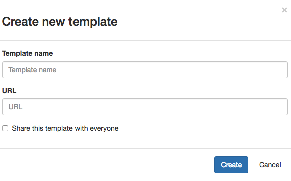
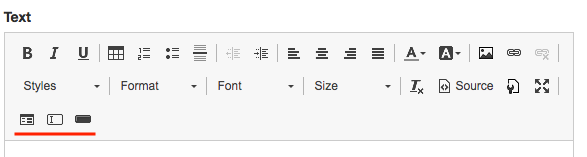
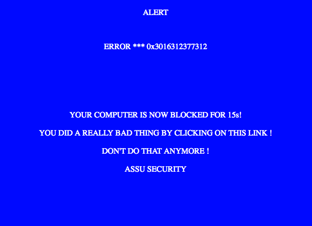

.. _templates:

Templates
=========

Templates are all the mails / attachment / web pages that will be sent or displayed to the targets in the different campaigns.

Different kind of templates are available, depending on the kind of campaign you want to run:

.. image:: images/16-templates-types.png
    :align: center

Common best practices to create templates:

* Picture resizing on the fly (by setting width or height values) are sometimes not taken in consideration by mail clients and word
* It’s recommended to test templates before starting a campaign using the test functionality (campaigns test functionality)
* Templates can be shared with the community using the tick box at the bottom of the form. This will authorize any SwordPHISH user to use it for a campaign.
* A “fullscreen” button is provided in the rich text editor for a better user experience

Mails with link
---------------

This template is the most common one; it corresponds to a simple mail with a link.

The only constraint to use this kind of template is to insert a link in the HTML that points to “FXMEURL”.

This keyword is used to inject the target’s dedicated link. When creating or editing this kind of template, this constraint will be automatically checked and an error will be displayed in case of omission.

.. image:: images/17-mail-with-link.png
    :align: center

The “Subject” input corresponds to the mail’s title.

Standard templates
------------------

This category regroups templates of files / mails that will be sent to the targets.

Mails with attachment
^^^^^^^^^^^^^^^^^^^^^

This kind of template corresponds to a mail that will have an attachment. Contrary to the “mail with link” template it doesn’t need any link.

Attachment
^^^^^^^^^^

This template corresponds to the attachment that will be added to the mail.

The attachment is created as an HTML file and is converted on the fly as an Office Word “.doc” file.

No special requirements are expected to use this kind of template.

Actions after click
-------------------

This category regroups templates of actions that will be done once the targets will click on the malicious links.

Redirection
^^^^^^^^^^^
This template is used to define redirection to an arbitrary URL. You only have to provide a URL using the standard format: http(s)://(www.)?domain.tld(/webpage)?

Awareness
^^^^^^^^^
This template allows you to create an awareness webpage that will be displayed to the user in case of click on a malicious link.

Fake form
^^^^^^^^^

This template allows you to create a fake form to lure targets. A set of buttons dedicated to forms creation is added to the rich editor:

An HTML form must be inserted in the template using the first button:

.. image:: images/20-formset.png
    :align: center

You can then use the “text input” and “button” buttons to create your form. At least one “submit” button must be inserted within the HTML form:

.. image:: images/21-submit-button.png
    :align: center

You can then use the “text input” and “button” buttons to create your form. At least one “submit” button must be inserted within the HTML form

The fake form will be forged automatically in a way that **no credential will be sent through the internet** for evident reasons of confidentiality.

**No credential will be harvested during the campaigns.**

Fake ransomware
^^^^^^^^^^^^^^^

Fake ransomware has been developped to frighten a bit more swordphish targets. Be reassured, it won't encrypt any file. It's more a tech scam than a ransomware.

The goal is to display an image to lure targets to click on it,

.. image:: images/25-ransomware-1.png
    :align: center

then the webpage will go fullscreen during a certain amount of time to pretend that the target's browser is blocked displaying a frightening message.

Of course the browser won't be blocked.

When the timer reach 0, another customizable on click action will be triggered (awareness, redirection...)

To create a fake ransowmare template, create one page and use "normal" style on the first practices.

.. image:: images/27-ransomware-3.png
    :align: center

and "normal (div)" on the second part.

.. image:: images/28-ransomware-4.png
    :align: center

swordphish will automatically deal with it and display each part when necessary.

Add images to templates
-----------------------

To add images in your templates please follow these steps:

* click on the dedicated button

.. image:: images/22-images-button.png
    :align: center

* choose a file and “that’s it”, file are stored directly within the HTML code in base64

.. image:: images/23-upload-image.png
    :align: center

*  you can change image size by right clicking on it and using “image” submenu

.. image:: images/24-image-size.png
    :align: center
