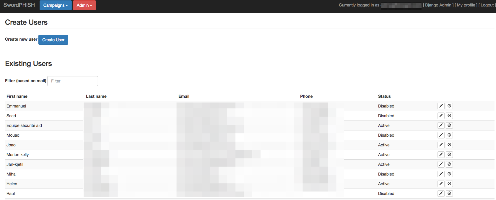
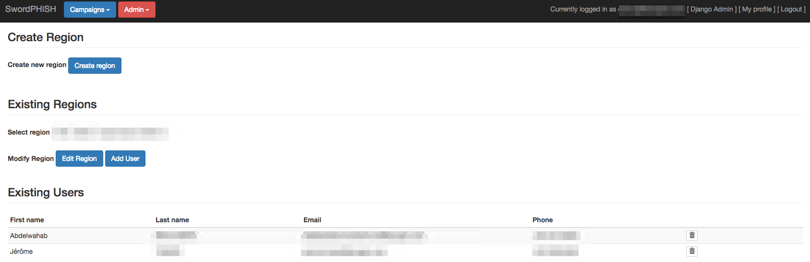

.. _users-management:

Users management
================

Overview
--------

Users management menu is available for django staff and entities admins only.

.. image:: images/06-admin-menu.png
    :align: center

Swordphish's users management has been built to allow collaboration within the same team of users.

Visibility can be organised using *entities* and *regions*. *Regions* are sub parts of *entities* and you can create them to fit your oganisation.

For example, if your structure is composed of retail banks and investment banks, you can create two entities "Retail" and "Investment" then create sub regions for every country, like Retail France, Retail Germany, Investment UK, Investment Asia...

If a user is positionned as admin in an entity, he will be able to create users accounts and position them in his regions or entities. He will also see every campaign created in his entities and regions by every users.

If you position several users in the same region they will be able to see each others targets lists, templates and campaigns.

Users
-----

Users interface displays the different users accounts already existing in Swordphish with a filter based on mail address.

User creation is kinda straightforward, after having filled the form, a mail will automatically be sent to the user with a temporary password that need to be changed at the first connection.

.. image:: images/08-users-menu-creation.png
    :align: center

Entities
--------

Entities interface displays the different existing entities

.. image:: images/09-entities-interface.png
    :align: center

and also creation menu and admin management.

.. image:: images/10-entities-admin.png
    :align: center

Regions
-------

Regions interface is quite the same

except that you have to chose the entity to attach to when creating organised

.. image:: images/11-regions-admin.png
    :align: center
